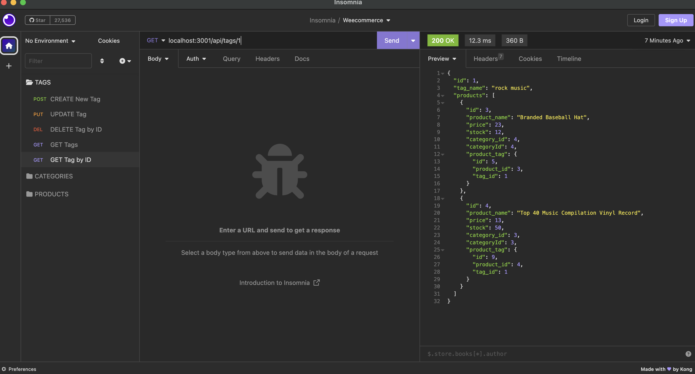

# Weecommerce

This project is my weecommerce that uses technologies like Express.js, Sequelize as the ORM for the SQL database, and MySQL as the database management system. This project has various API routes the allow for the CRUD (create,read, update, delete) data in the database and could be tested using a tool like Insomnia. 🤓

## User Story

- AS A manager at an internet retail company
- I WANT a back end for my e-commerce website that uses the latest technologies
- SO THAT my company can compete with other e-commerce companies

## Acceptance Criteria

- GIVEN a functional Express.js API
- WHEN I add my database name, MySQL username, and MySQL password to an environment variable file
- THEN I am able to connect to a database using Sequelize
- WHEN I enter schema and seed commands
- THEN a development database is created and is seeded with test data
- WHEN I enter the command to invoke the application
- THEN my server is started and the Sequelize models are synced to the MySQL database
- WHEN I open API GET routes in Insomnia for categories, products, or tags
- THEN the data for each of these routes is displayed in a formatted JSON
- WHEN I test API POST, PUT, and DELETE routes in Insomnia
- THEN I am able to successfully create, update, and delete data in my database

### Technologies 
This back-end for Weecommerce will be built using the following technologies:

- Express.js for the server framework
- Sequelize as the ORM for the MySQL database
- MySQL as the database management system
- Insomnia 

### Installation 
To install and use Weecommerce, please follow these steps:
- Clone this repository to your local machine.
- Open the project directory and run npm install to install the project dependencies.
- Create an environment variable file .env and add the following variables:
´´md 
DB_NAME=<your-database-name>
DB_USER=<your-database-username>
DB_PASSWORD=<your-database-password>
´´
- Type the following commands to create and seed the development database:
´´´
User@User Develop% npm i
 mysql -u root -p
 Enter your password: ********

 source db/schema.sql

 exit

 User@User Develop% npm run start
´´´
- Open Insomnia to test the API routes

#### API routes: 

- GET /api/tags
- POST /api/tags
- PUT /api/tags/:id
- GET /api/tags/:id
- DELETE /api/tags/:id
- POST /api/categories
- PUT /api/categories/:id
- DELETE /api/categories/:id
- GET /api/categories
- GET /api/categories/:id
- POST /api/products
- PUT /api/products/:id
- GET /api/products
- DELETE /api/products/:id
- GET /api/products/:id

## Mock-Up

The following animation shows the application's GET routes to return all categories, all products, and all tags being tested in Insomnia:

The following animation shows the application's GET routes to return a single category, a single product, and a single tag being tested in Insomnia:

The following animation shows the application's POST, PUT, and DELETE routes for categories being tested in Insomnia:

[GitHub/Jeacqueline Weecommerce](https://github.com/Jeacqueline/Weecommerce)

[Video/ Jeacqueline/ My Super Team](https://drive.google.com/file/d/1F3CGWYtApL9iedhPOwA2-xmEwpLtCzZB/view)
